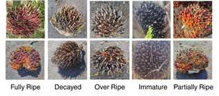
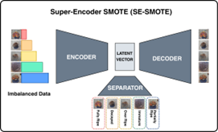
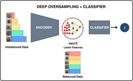
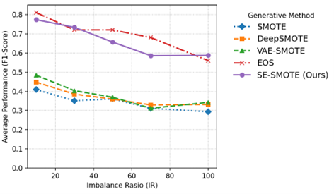
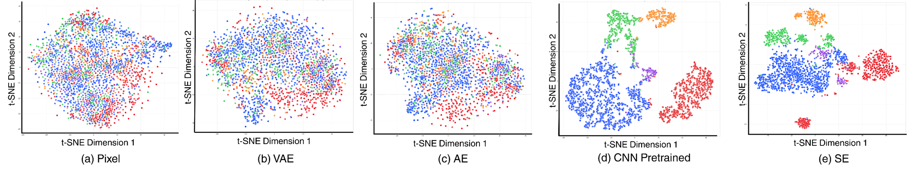
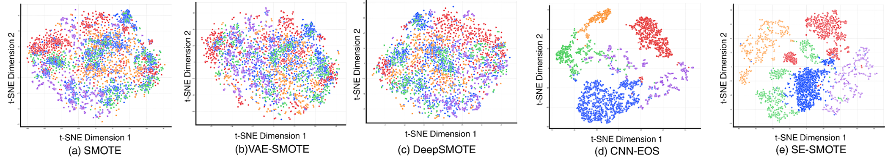

<div align="center">

# SE-SMOTE

### Latent-Space Oversampling for Long-Tailed Oil Palm Fruit Classification

*A supervised autoencoder that learns class-separable latent features **before** oversampling — so synthetic samples land where they belong.*

[](https://www.python.org/)
[](https://pytorch.org/)
[](https://scikit-learn.org/)
[](./LICENSE)
[](#citation)

</div>

---

## TL;DR

> **Problem.** Oil palm plantations produce highly imbalanced fruit images — common ripeness classes vastly outnumber rare ones, and classifiers trained on this skew fail on the minority classes that matter for harvest scheduling.
>
> **Method.** We train a **Super-Encoder** — an autoencoder with an auxiliary **Separator** classifier — so that the latent space is both *reconstructable* and *class-separable*. Then we run SMOTE **inside that latent space**, not on pixels.
>
> **Result.** At the most extreme imbalance (**IR = 100**), SE-SMOTE reaches **macro-F1 = 0.621**, vs. EOS 0.594, VAE-SMOTE 0.308, DeepSMOTE 0.275, and pixel-space SMOTE 0.276 — **more than doubling** the best autoencoder-based baselines and clearly leading the previous state-of-the-art (EOS) where imbalance matters most.

---

## Why This Matters

Harvesting oil palm at the right ripeness stage is a multi-billion-dollar problem, yet the class distribution that a plantation camera actually *sees* is long-tailed — fully ripe fruits dominate, while the rare classes (immature, over-ripe, decayed) are the ones operators most want to flag. Off-the-shelf oversampling in pixel space produces unrealistic images; standard latent-space oversampling with unsupervised autoencoders produces entangled clusters. SE-SMOTE addresses both failure modes.

<p align="center">
  
</p>

<p align="center"><i>Five ripeness classes in the benchmark: Fully Ripe, Decayed, Over Ripe, Immature, Partially Ripe.</i></p>

---

## How It Works

SE-SMOTE is a **two-phase** framework. Phase 1 shapes the latent space; Phase 2 oversamples inside it.

### Phase 1 — Learn a separable latent space

<p align="center">
  
</p>

A **Super-Encoder** is trained on the imbalanced data with three components sharing one latent vector `z`:

- **Encoder `E`** — CNN that compresses a 64×64 RGB image into a 4096-dim latent vector `z`.
- **Decoder `D`** — deconvolutional network that reconstructs the image from `z`.
- **Separator `S`** — MLP classifier that forces `z` to be class-discriminative.

The Super-Encoder minimises a combined loss:

$$
\mathcal{L}_{\text{SE}} \;=\; \beta\,\underbrace{\mathcal{L}_{\text{rec}}}_{\text{MSE}(D(E(x)),\,x)}\;+\;\alpha\,\underbrace{\mathcal{L}_{\text{sep}}}_{\text{CE}(S(E(x)),\,y)}
$$

with `β = 1.0` (reconstruction) and `α = 0.1` (separability). The reconstruction term keeps `z` informative; the separability term keeps classes from collapsing into each other.

### Phase 2 — Oversample in the learned latent space

<p align="center">
  
</p>

1. Freeze `E` and encode the whole training set into latent vectors.
2. Apply SMOTE in the latent space: for each minority sample `z_i`, pick a neighbour `z_j` and interpolate

   $$z_{\text{new}} = z_i + \lambda\,(z_j - z_i),\quad \lambda \sim \mathcal{U}(0, 1)$$

   until every class is balanced.
3. Train a standard classifier (SVM, KNN, Logistic Regression, XGBoost, Random Forest) on the balanced latent features.

Because the latent space is already class-separable, the interpolated points stay inside the correct class manifold instead of drifting into the decision boundary.

---

## Results at a Glance

<p align="center">
  
</p>

**Macro-averaged F1 — best classifier per cell, as reported in the paper:**

| Method              | IR = 10 (mild)    | IR = 100 (extreme) |
|---------------------|-------------------|--------------------|
| SMOTE               | 0.484             | 0.276              |
| DeepSMOTE           | 0.382             | 0.275              |
| VAE-SMOTE           | 0.528             | 0.308              |
| EOS                 | 0.816             | 0.594              |
| **SE-SMOTE (ours)** | **0.863**         | **0.621**          |

**The honest picture.** SE-SMOTE is the top method at **IR = 10** (by ~0.05 macro-F1 over EOS) and at **IR = 100** (by ~0.03 over EOS, and by more than 2× over every autoencoder-based baseline). At **IR = 30, 50, 70**, SE-SMOTE and EOS trade the top spot — EOS edges SE-SMOTE in the mid-range, and SE-SMOTE pulls ahead as imbalance becomes severe. The *where it matters most* regime — extreme imbalance — is where the supervised latent space pays off clearly.

See [`docs/RESULTS.md`](./docs/RESULTS.md) for the full 5-classifier × 5-IR grid straight from the paper's Table II.

### Does the latent space really look cleaner?

Yes. t-SNE of the latent space **before** oversampling — Super-Encoder (rightmost) produces clearly separated class clusters while VAE/AE/pretrained-CNN latents remain entangled:

<p align="center">
  
</p>

And **after** oversampling — SE-SMOTE (rightmost) preserves the class structure; pixel-space SMOTE and unsupervised baselines smear synthetic samples across boundaries:

<p align="center">
  
</p>

---

## Repository Structure

```
SE-SMOTE/
├── src/
│   ├── config.py                   # Paths, hyperparameters, device, seeding — single source of truth
│   ├── data/
│   │   ├── preprocessing.py        # Build long-tailed split → data/preprocessed_dataset.zip
│   │   └── dataset.py              # Torch Dataset / DataLoader utilities
│   ├── models/
│   │   ├── encoder.py              # 5-block convolutional Encoder (3 → 64 → … → 512 → latent_dim)
│   │   ├── decoder.py              # Mirror deconv Decoder (latent_dim → 3×64×64, Sigmoid)
│   │   ├── separator.py            # MLP classifier head on top of the latent vector
│   │   └── super_encoder.py        # Wraps Encoder + Decoder + Separator, exposes encode/decode/classify
│   ├── oversampling.py             # Phase 2 — SMOTE in latent space, t-SNE viz, decode synthetic images
│   └── training/
│       └── train.py                # Phase 1 — train Super-Encoder with L_rec + α·L_sep
├── scripts/
│   ├── run_preprocess.py           # Thin CLI wrapper that invokes data.preprocessing.main()
│   ├── run_train.py                # Thin CLI wrapper that invokes training.train.main()
│   └── run_oversample.py           # Thin CLI wrapper that invokes oversampling.main()
├── data/                           # Images/ (raw) and Images.zip / preprocessed_dataset.zip
├── assets/                         # Figures referenced by this README and the paper
├── docs/RESULTS.md                 # Full per-IR, per-classifier results from the paper's Table II
├── paper/                          # Published PDF
├── requirements.txt
├── CITATION.cff
├── LICENSE
└── README.md
```

---

## Getting Started

### 1. Clone and install

```bash
git clone https://github.com/luckysantoso/se-smote.git
cd se-smote
python -m venv .venv && source .venv/bin/activate    # Windows: .venv\Scripts\activate
pip install -r requirements.txt
```

### 2. Prepare the dataset

Unzip the dataset into the expected ImageFolder layout:

```bash
unzip data/Images.zip -d data/
# Windows (PowerShell): Expand-Archive data/Images.zip -DestinationPath data/
```

You should end up with `data/Images/<ClassName>/*.jpg` for the five classes.

### 3. Run the pipeline

All scripts are in `scripts/`. Run them from the **repository root** so relative paths in `src/config.py` resolve correctly:

```bash
python scripts/run_preprocess.py     # build long-tailed split → data/preprocessed_dataset.zip
python scripts/run_train.py          # Phase 1: train Super-Encoder → best_super_encoder_model.pth
python scripts/run_oversample.py     # Phase 2: SMOTE in latent space + t-SNE + decoded samples
```

<details>
<summary><b>Reproduce in one shot</b></summary>

```bash
python scripts/run_preprocess.py && python scripts/run_train.py && python scripts/run_oversample.py
```

Training runs for up to 200 epochs with early stopping (patience = 15). Wall-clock time depends on hardware; on a single consumer-grade GPU, IR = 10 typically converges in tens of minutes, and higher imbalance ratios are faster because the dataset is smaller.

</details>

---

## Key Hyperparameters

All knobs live in [`src/config.py`](./src/config.py). The defaults reproduce the paper's IR = 10 setting:

| Parameter                | Value  | Notes                                   |
|--------------------------|--------|-----------------------------------------|
| `image_size`             | 64     | Square RGB input                        |
| `latent_dim`             | 4096   | Shared latent size                      |
| `epochs`                 | 200    | Max; early stop at patience = 15        |
| `batch_size`             | 32     |                                         |
| `learning_rate`          | 1e-4   | Adam                                    |
| `weight_decay`           | 1e-5   |                                         |
| `alpha_sep`              | 0.1    | Weight of `L_sep` (classification)      |
| `beta_recon`             | 1.0    | Weight of `L_rec` (reconstruction)      |
| `dropout_prob`           | 0.5    |                                         |
| `l2_normalize_latent`    | True   | Normalises `z` before decoder/separator |
| `imbalance_factor`       | 10.0   | Geometric long-tail factor              |
| `tail_class_label`       | 2      | Class index treated as the tail         |
| `test_size`              | 0.2    | Stratified train/val split              |

---

## Extending SE-SMOTE

- **Swap the downstream classifier.** The balanced latent features saved to `latent_features_dataset.zip` are plain NumPy arrays — drop in any scikit-learn estimator.
- **Change the imbalance severity.** Edit `PreprocessConfig.imbalance_factor` in `src/config.py` and rerun `python scripts/run_preprocess.py`.
- **Use your own dataset.** As long as you can produce an `ImageFolder` at `data/Images/<class>/*.jpg`, the rest of the pipeline works unchanged — just revisit `latent_dim` and `alpha_sep` if your class count or image complexity differs.
- **Try a different autoencoder backbone.** `encoder.py` and `decoder.py` are intentionally small and unopinionated; replace them with ResNet / ConvNeXt blocks while keeping the Super-Encoder interface.

---

## Citation

If you use this code or the method in your research, please cite:

```bibtex
@inproceedings{santoso2025sesmote,
  author    = {Santoso, Lucky and Kamal, Inam Mustafa and Navastara, Dini Adni and Subakti, Misbakhul Munir Irfan},
  booktitle = {Proc. 2025 15th International Conference on Information \& Communication Technology and System (ICTS)},
  title     = {{SE-SMOTE}: Latent-Space Oversampling for Long-Tailed Oil Palm Fruit Classification},
  year      = {2025}
}
```

**IEEE format:**

> L. Santoso, I. M. Kamal, D. A. Navastara, and M. M. I. Subakti, "SE-SMOTE: Latent-space oversampling for long-tailed oil palm fruit classification," in *Proc. 2025 15th Int. Conf. Inf. Commun. Technol. Syst. (ICTS)*, 2025.

---

## Authors

All authors are with the Department of Informatics, **Institut Teknologi Sepuluh Nopember (ITS)**, Surabaya, Indonesia.

- **Lucky Santoso** — first author, correspondence
- **Inam Mustafa Kamal**
- **Dini Adni Navastara**
- **Misbakhul Munir Irfan Subakti**

---

## License

Released under the [MIT License](./LICENSE). You are free to use, modify, and distribute the code with attribution.

---

<div align="center">

*If SE-SMOTE helped your work, a star on the repo and a citation in your paper go a long way.*

</div>
